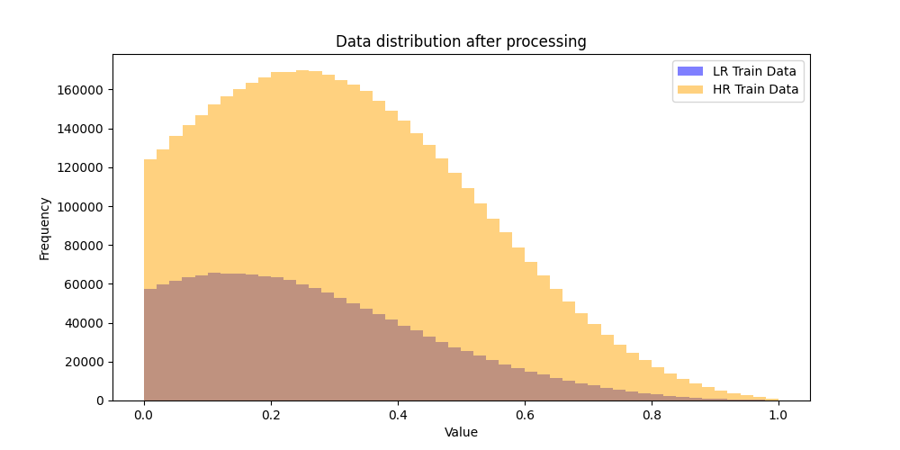
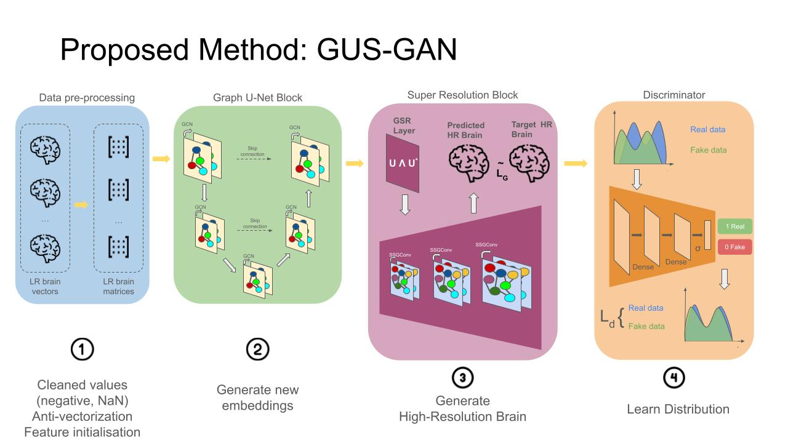

# DGL2024 Brain Graph Super-Resolution Challenge

Note: in the following readme we use LaTeX notation for mathematical expressions. It renders correctly in VSCode, but
not PyCharm. We thus recommend using VSCode or other editors that support LaTeX rendering. The readme is similar to the
pdf report but contains some additional information that didn't fit the 2-page limit.

## File structure

In the root directory, you can find the following files:

- the `gan` directory, which contains the implementation of the GUS-GAN model
    - `config.py`, which contains the hyperparameters for the model
    - `initializations.py`, which contains initialisation functions for the model layers
    - `layers.py`, which contains the implementation of different layers used in the model
    - `model.py`, which contains the implementation of the GUS-GAN model
    - `preprocessing.py`, which contains the preprocessing functions for the data
    - `train.py`, which contains the training loop for the model
- the `images` directory, which contains additional images used in the readme
- the `submissions` directory, which contains the submission csv files (the predictions for the 3-fold cross-validation
  and the final predictions for the test set)
- `constants.py`, which contains the constants used in the project
- `Evaluator.py`, which contains the implementation of the evaluation methods
- `hyperparam.py`, which contains the hyperparameter search for the model
- `main.py`, which contains the main method for the project, which runs the 3-fold cross-validation, the subsequent
  training on the whole dataset, and generates the submission file
- `MatrixVectorizer.py`, which contains the implementation of the matrix vectorisation utilities
- `performance_measures.png`, which contains the plot of the performance measures across the 3 folds of the
  cross-validation
- `README.md`, which contains the project report
- `requirements.txt`, which contains the required libraries for the project
- `set_seed.py`, which contains the method to set the random seed
- `utils.py`, which contains the utility methods for the project
- `utils_tests.py`, which contains unit tests for the utility methods

The submission does not contain the data, the SLURM scheduling scripts, the logs, checkpoints, or submission files
generated by other models we trained. They can be found in our GitLab repository, should you need them.

## Contributors

- Kevin Mancini 02461016
- Angelos Ragkousis 02476433
- Adam Tlemsani 01911287
- Kyveli Tsioli 01932542
- Mikolaj Deja 02522246

## Problem Description

Acquiring MRI data in high spatial resolution is a very costly process, and it's often much easier to gather
low-resolution data which can be later super-resolved. The use of deep learning for this task proved a viable method in
recent years [3]. However, super-resolving brain graphs is a challenging task, due to the complexity of
non-Euclidean data as well as the inherent requirement for the super-resolution process to preserve the topological
importance of the low-resolution graph while expanding the graph topology with new nodes and edges. To address this
task, the AGSR-Net model [3] was introduced, which uses a super-resolution Generator (SRG) based on graph neural
networks along with a Discriminator to generate a realistic high-resolution (HR) from a low-resolution (LR) connectome.
In this work, we extend the model into an improved version, named GUS-GAN. The new model uses a more expressive
generator, better feature initialisation and a refined optimisation loss, achieving competitive MAE and PCC scores.

Our model is trained on the SLIM functional MRI dataset [2], which includes 279 pairs of high-resolution (HR) and
low-resolution (LR) matrices $A_l \in \mathbb{R}^{L\times L}$ and $A_h \in \mathbb{R}^{H\times H}$, where $L=160$ and
$H=268$ are the corresponding resolutions. The matrices are weighted based on the strength of connectivity between brain
regions. The examples are provided in a vectorised form, where the off-diagonal upper triangular elements are stacked
into vectors of size $D_l \in \mathbb{R}^{279\times 12720}$ and $D_h \in \mathbb{R}^{279\times 25778}$ respectively.

Given an input LR graph, the problem of brain graph super-resolution aims to learn a function $f$ that maps the graph
into an HR graph: $f:\mathbf{G_l = (A_l,X_l) \rightarrow G_h = (A_h,X_h)}$. To this end, we first split the data into a
training set of 167 pairs and a test set of 112 pairs. We then performed anti-vectorisation to transform the data into
the original adjacency matrices suitable for processing. We also replaced all negative values with 0 since they may not
have a clear biological interpretation, although this is a controversial opinion according to recent studies [1].
The data distribution after pre-processing is shown below.



We finally initialised our node feature matrix $X_l \in \mathbb{R}^{L\times L}$ with the average of six topology-based
measures, namely the Eigenvector Centrality, Betweenness Centrality, Closeness Centrality, PageRank, node degree and
Clustering coefficient of nodes, in order to assist our model in finding meaningful connections. This empirically proved
helpful with the super-resolution task. We also tried different initialisations, such as random initialisation and
the identity matrix, but the average of the topology-based measures yielded the best results.

## GUS-GAN - Methodology

In this work, we created an improved version of the AGSR-Net model [2], which we named **GUS-GAN**, based on
its main components (**G**SR-Net, **U**-Net, **S**SGConv). The model architecture is shown below.



First, we summarise the main components of the AGSR-Net model below:

### Super-Resolution Generator (SRG)

The SRG generator consists of two sub-modules:

#### Graph U-Net

The authors use the Graph U-Net [4] model to first transform the node features of the LR graph to the HR space, by
performing the mapping $(A_l,X_l)\rightarrow(A_l, Z_l)$, where $Z_l \in \mathbb{R}^{L \times H}$. The model uses an
encoder and a decoder. The encoder uses two blocks, each composed of a graph pooling layer and a GCN layer. The graph
pooling layer sequentially generates a smaller graph by selecting the most important nodes and the GCN layer aggregates
the features of its neighboring nodes based on their connectivity weights. Then, the decoder uses upsampling to
transform the graph to its original resolution, in order to decode high-level features.

#### Graph Super-Resolution Layer (GSR)

The authors introduce a GSR layer that super-resolves both the connectivity matrix from the LR space to the HR space and
the transformed features taken from the Graph U-Net, i.e. it performs the final mapping $(A_l,Z_l)\rightarrow(A_h,X_h)$.
This is achieved using a spectral upsampling method based on graph Laplacian decomposition proposed in [5].
Specifically, the propagation rule is formulated as $\mathbf{A_h = W S U Z_l}$, where $Z_l \in \mathbb{R}^{L \times H}$
are the features learned by the Graph U-Net, $U \in \mathbb{R}^{L \times L}$ is the matrix of eigenvectors of the graph
Laplacian from the LR graph, $W \in \mathbb{R}^{H \times H}$ is a trainable matrix and $S$ is an identity matrix. The
node features are then super-resolved as $X_h =A_h{A_h}^T$.

Then, two GCN layers are used to refine the new adjacency matrix in a learnable way. This is an interesting method,
since we're not keeping the generated adjacency matrix but encode it in the node features, since they can be easily
learned with graph convolutions. Finally, we make sure the generated adjacency matrix is symmetric and represents a
valid brain graph network.

#### Discriminator Network

The incorporation of adversarial training ensures that the predicted HR graphs preserve the distribution of the original
connectivity weights of the dataset. It uses a 2-layer MLP network, which outputs the probability that the generated HR
graph by the SRG network is real.

### Model Improvements

Based on the baseline AGSR-Net model described above, we introduce a number of improvements summarised below.

#### Optimised Graph-UNet with a larger hidden dimension and a refined loss function

We changed the Graph-UNet implementation to the one provided by PyTorch Geometric [7], which streamlines the
integration of skip connections by making use of optimised graph operations. We also increased the network's capacity by
setting the hidden dimension to 512.

This change also led us to refine our loss function. In the AGSR-Net framework, the loss function consists of the
following components: MSE, regularisation of GSR layer with eigen-decomposition of HR adjacency matrix, U-Net
reconstruction and GAN losses. In our implementation, we removed the eigen-decomposition and U-Net reconstruction
losses. The original GSR Layer required padding the HR graphs, because in the proposed formulation it created graphs of
size 320x320 instead of 268x268. This is wasteful and can be removed by reshaping the weights parameter to have size
${2*L \times H}$, to accommodate the transition from LR to HR directly and avoid padding. After this change, we couldn't
use the same loss terms anymore, but our experiments indicated that replacing them with an L2 regulariser for the GSR
Layer weights slightly improved the performance, while reducing computational complexity. Hence, our final loss
consists of the MSE, L2 regularisation for the GSR layer, and the adversarial loss.

#### SSG Convolution Layer

After the GSR Layer, the AGSR-Net model uses two GCN layers to refine the adjacency matrix of the super-resolved graph.
In our initial experiments, we added a third GCN layer in order to make the network deeper and more expressive. We
wanted to determine whether aggregating from a 3-hop neighbourhood could improve the performance compared to the 2-hop
neighbourhood aggregation of the 2-layer GCN model. However, the performance degraded, and we encountered the problem of
oversmoothing [6], which occurs when the representations of the nodes in GCNs tend to converge to non-distinctive
embeddings as the number of layers increases.

To address this issue, we replaced the two layers with a more expressive version of GCN, named "Simple Spectral Graph
Convolution", or simply SSG Convolution [8]. The intuition is to widen the receptive field of the aggregation
function while keeping the depth of the network constant. This is achieved by aggregating $k$-step matrices, which is
equivalent to aggregating over neighborhoods of gradually increasing sizes.

$$X' = \frac{1}{K} \sum_{k=1}^{K} \left( (1 - \alpha) \left(\hat{D}^{-\frac{1}{2}} \hat{A} \hat{D}^{-\frac{1}{2}}
\right)^k X + \alpha X \right) \Theta$$

As shown in the equation above, all $k$-step matrices are summed in the same update step, and the hyperparameter
$\alpha$ is
used to balance the self-information of each node with its consecutive neighborhoods. After performing hyperparameter
tuning, we settled on 2 SSG Convolution layers with $K=3$ and $\alpha=0.1$ for our final model, due to empirically the
best performance.

#### Normalisation Techniques

We also experimented with different normalisation methods for the LR adjacency matrix preprocessing. Clustering
normalisation, which focuses on the local grouping of nodes, performed the worst and did not seem to capture the broader
context of node relationships in the LR graph, which can be crucial when extending the LR to the new HR graph. Similar
performance was observed using Betweenness Centrality, which, on the contrary, could be considered a global
normalisation method, as it emphasizes nodes that serve as bridges within the network. Degree normalisation yielded the
best performance, by finding a better balance between local and global node properties, and good computational
efficiency.

### Node Permutation Invariance and Equivariance

Considering all nodes in the graph, the model can be shown to be Permutation Equivariant. This flows from the nature of
operations used: GCNs, downsampling, upsampling, and GSR Layer. It is not permutation invariant as a whole, as a
permutation on the initial node embeddings would propagate through all the layers and would affect the final
super-resolved graph. This can be seen for a GCN by permuting the feature and adjacency matrices to $P^T\hat{A}P$ and
$H_kP$:

$$H'_{k} = \alpha\left(\Psi_k (H_kP)(P^T\hat{A}P)\right) =\alpha \left(\Psi_k H_k\hat{A}P \right) = H_kP$$

The same argument applies to the other operations used. Since all operations on the way are permutation equivariant,
their chain is as well.

## Used External Libraries

- PyTorch
- PyTorch Geometric

To install the required libraries, run the following command:

```bash
virtualenv venv
source venv/bin/activate
pip install -r requirements.txt
```

To run the code, one should execute the `main.py` file. There is also a hyperparameter search file, `hyperparam.py`,
that can be used to find the best hyperparameters for the model. It uses `wandb` to log the results of the
hyperparameter. Note that the `wandb` api key should be set at the top of the file.

We do not recommend running the hyperparameter search or the training locally, as it is very time-consuming. Instead, we
used the GPU cluster provided by the university.

Note: it seems like the training process is not fully deterministic, so the results may vary slightly between runs. Even
though we set the random seed at the beginning of the training process, the logs show small differences in the results
and the final predictions. This might be due to certain operations on the GPU that cannot guarantee determinism. We
cannot verify if the results are reproducible on CPU because GraphUNet is not supported on CPU. We apologise for the
inconvenience.

## Results

We evaluated robustness and generalisation of our model using 3-fold Cross Validation. Employing a range of performance
metrics including Mean Absolute Error (MAE), Pearson Correlation Coefficient (PCC), Jensen-Shannon Distance (JSD), as
well as the MAE of various centrality measures such as Betweenness, Eigenvector, PageRank, Closeness, and Degree
centrality, we managed to assess the topological accuracy of our super-resolved graphs. The model shows
consistent performance over all metrics across all folds, which can be seen in the image below.


In more detail, consistent JSD values across folds imply that
the probability distributions of the predicted and ground truth graphs remain similar, showcasing the model's ability to
preserve the underlying distributional characteristics of the brain graphs. The centrality measures show very slight
variations across the folds, but values largely remain consistent, proving that our model adequately preserves key
topological features ensuring that the structural and functional significance of nodes in the super-resolved graphs "
mirrors" that of the ground truth. With an average MAE of 0.14186, our findings show high fidelity in the generated
high-resolution graphs relative to the ground truth.

We added some metrics, namely the MAE of the degree centrality and the clustering coefficient, to add to the analysis of
the topological accuracy of the super-resolved graphs. The results are consistent with the other metrics, showing that
our model is able to preserve the topological features of the ground truth graphs. We also experimented with the use of
Frechet Inception Distance (FID) as a metric, but we ran into computational issues and were unable to obtain meaningful
results. We kept running out of memory both on the GPU and the CPU, and we were unable to find a solution to this
problem.

The total training time for the 3-fold cross-validation was approximately 110 minutes, with a RAM usage of approximately
1.62 GB, which indicates a moderate computational demand.

We then retrained the model on the whole dataset, using the same methods as for CV, namely the same hyperparameters and
early stopping procedure. After uploading our predictions on the test set to Kaggle, our score on the public test set
was 0.1317,
and we ranked 16th across 32 groups.

## References

1. L. Zhan et al., “The significance of negative correlations in brain connectivity,” Journal of Comparative
   Neurology, vol. 525, no. 15, pp. 3251–3265, Jul. 2017, doi: https://doi.org/10.1002/cne.24274.
2. W. Liu, D. Wei, Q. Chen, W. Yang, J. Meng, G. Wu, T. Bi, Q. Zhang, X.-N. Zuo, and J. Qiu. Longitudinal
   test-retest neuroimaging data from healthy young adults in southwest china. Scientific data, 4(1):1–9, 2017
3. M. Isallari and I. Rekik, “Brain Graph Super-Resolution Using Adversarial Graph Neural Network with
   Application to Functional Brain Connectivity,” arXiv.org, May 02, 2021. https://arxiv.org/abs/2105.00425
4. Gao, H., Ji, S., 2019. Graph u-nets, in: Chaudhuri, K., Salakhutdinov, R. (Eds.), Proceedings of the 36th
   International Conference on Machine Learning, PMLR, Long Beach, California, USA. pp. 2083–2092
5. Tanaka, Y., 2018. Spectral domain sampling of graph signals. IEEE Trans- actions on Signal Processing 66,
   3752–3767.
6. Qimai Li, Zhichao Han, and Xiao-Ming Wu. Deeper insights into graph convolutional networks for
   semi-supervised learning. In Proceedings of the Thirty-Second AAAI Conference on Artificial In- telligence (AAAI-18),
   pp. 3538–3545. Association for the Advancement of Artificial Intelligence, 2018a.
7. Fey, M. and Lenssen, J.E. (2019) Fast graph representation learning with pytorch geometric, arXiv.org.
   Available at: https://arxiv.org/abs/1903.02428
8. H. Zhu and P. Koniusz, "Simple Spectral Graph Convolution," in International Conference on Learning
   Representations, 2021. https://openreview.net/pdf?id=CYO5T-YjWZV